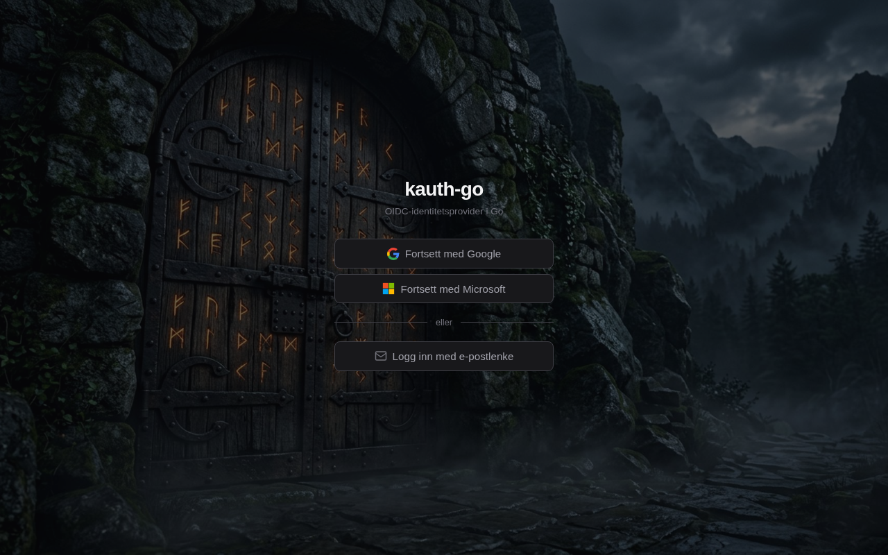

<div align="center">
    <h1>kauth</h1>
    <p>An OIDC identity provider in Go, for small organisations.</p>
    <p><strong>English</strong> · <a href="README.no.md">Norsk</a></p>
</div>



An OIDC identity provider written in Go. The idea is that small organisations shouldn't have to stand up a Keycloak or a Zitadel just to get central sign-in across a couple of services.

A single static binary of ~14 MB. ~25 MB RAM in production. SQLite under the hood, RS256-signed JWTs, and Cloudflare Tunnel in front for TLS and DDoS protection.

Running in production across a handful of services.

## What kauth does

- Issues JWTs (RS256)
- Rotates refresh tokens with reuse detection (OAuth BCP §4.13)
- Exposes JWKS and OpenID Discovery under `/.well-known/`
- Offers four sign-in paths per service: Google OIDC, Microsoft OIDC, email magic link, and passwords (the last one off by default — see *The passwordless choice* below)
- Central user administration: one admin panel for every service
- Audit log with 90-day retention, filterable on every column and exportable to CSV

Each service is configured data-driven in the `services` table. Onboarding is a single INSERT.

## Getting started locally

```bash
git clone git@github.com:zral/kauth-go.git
cd kauth-go
make build           # builds bin/kauth
```

Minimum configuration through environment variables:

```bash
export KAUTH_DB_PATH=./data/kauth.db
export KAUTH_ISSUER=http://localhost:8080
export KAUTH_BASE_URL=http://localhost:8080
export KAUTH_PRIVATE_KEY_PATH=./secrets/privateKey.pem
export KAUTH_PUBLIC_KEY_PATH=./secrets/publicKey.pem
export KAUTH_OIDC_STATE_SECRET=$(openssl rand -base64 48)
export KAUTH_SMTP_MOCK=true
export KAUTH_INSECURE_COOKIES=true   # local HTTP development only

./bin/kauth
```

Generate an RSA key pair if you don't have one already:

```bash
openssl genpkey -algorithm RSA -out secrets/privateKey.pem -pkeyopt rsa_keygen_bits:2048
openssl rsa -pubout -in secrets/privateKey.pem -out secrets/publicKey.pem
```

Migrations run automatically at startup.

## Onboarding a new service

A service is one row in the `services` table. Here is an imaginary app called "polaris", signing in with Google:

```sql
INSERT INTO services (
    id, display_name, tagline, domain, callback_url,
    email_from_name, email_from_address,
    auth_google, auth_magic_link, auth_microsoft, auth_password,
    auth_host,
    google_client_id, google_client_secret,
    default_role, default_org, auto_register,
    theme, accent_color, jwt_cookie_name,
    access_token_ttl, refresh_token_max_age,
    active, updated_at
) VALUES (
    'polaris', 'Polaris', 'Navigation for small teams',
    'polaris.example.com', 'https://polaris.example.com/auth/callback',
    'Polaris', 'noreply@polaris.example.com',
    1, 1, 0, 0,
    'auth.polaris.example.com',
    '812403915077-example-client-id.apps.googleusercontent.com',
    'GOCSPX-example-not-a-real-secret',
    'user', 'polaris', 1,                  -- auto-register as user/polaris
    'light', '#2563EB', 'auth_token',
    'PT30M', 'P30D',
    1, datetime('now')
);
```

The fields you'll set almost every time. The example values are the Polaris row above — a made-up service using Google as its only sign-in path, but with formats that sit close to the real thing:

| Field | Example | What it does |
|---|---|---|
| `id` | `polaris` | Short slug, no spaces. Used in URLs and JWT claims, so it should be stable — changing it later invalidates existing tokens. |
| `display_name` | `Polaris` | Shown on the login page and in the admin panel. |
| `tagline` | `Navigation for small teams` | Subtitle on the login page. Can be overridden per language in `internal/i18n`; this field is the fallback. |
| `domain` | `polaris.example.com` | The app's domain. Used to route callbacks back to the right place. |
| `callback_url` | `https://polaris.example.com/auth/callback` | Where the user lands after a successful login. Must match the app's callback endpoint exactly. |
| `auth_host` | `auth.polaris.example.com` | The hostname the auth page is served on for this service, giving each service a branded URL. It has to point at kauth through Cloudflare Tunnel, and `https://<auth_host>/callback` has to be whitelisted with Google. |
| `google_client_id` | `812403915077-example-client-id.apps.googleusercontent.com` | From Google Cloud Console. The real format is a 12-digit project number, a dash, 32 characters, then `.apps.googleusercontent.com`. Leave `NULL` to use the global client from `.env`. |
| `google_client_secret` | `GOCSPX-example-not-a-real-secret` | Same place, prefixed `GOCSPX-` followed by 28 characters. Stored in plaintext in the database — the file permissions on `kauth.db` are the protection. |
| `auth_google` | `1` | One column per sign-in path: `auth_google`, `auth_microsoft`, `auth_magic_link`, `auth_password`. Only the ones set to `1` appear on the login page. |
| `default_role` | `user` | What new users get in the `role` claim. |
| `default_org` | `polaris` | What new users get in the `org` claim. The app uses this for access control. |
| `auto_register` | `1` | `1` creates new users on first login. `0` means an admin has to create them first. |
| `access_token_ttl` | `PT30M` | ISO 8601 duration. A short access TTL and a long refresh keeps security and UX in balance. |
| `refresh_token_max_age` | `P30D` | How long a refresh family may live before the user has to sign in again. |
| `email_from_address` | `noreply@polaris.example.com` | Sender for magic links from this service. `NULL` uses global SMTP — see *Setting up magic links*. |
| `jwt_cookie_name` | `auth_token` | The cookie the token is set in. Distinct names per service avoid collisions on a shared parent domain. |
| `theme` / `accent_color` | `light` / `#2563EB` | Login page appearance. |

Once the row is in place, point the service's login flow at `https://<auth_host>/login?redirect_uri=https://<your-app>/auth/callback`. kauth handles the rest.

### CORS origins for the refresh flow

SPA clients that call `POST /token` to refresh (or read `/.well-known/*` from the browser) must be whitelisted in `KAUTH_CORS_ORIGINS`. Comma-separated, exact origin match — not a wildcard domain:

```bash
KAUTH_CORS_ORIGINS=https://app1.example.com,https://app2.example.com
```

If the app is missing from that list, the browser reports `No 'Access-Control-Allow-Origin' header is present` and the refresh round fails silently — the client keeps its old refresh token, the next attempt trips reuse detection, and the user is thrown back to the login page. The symptom looks like "logged out after 15 minutes" but the cause is in the network layer, not the token layer.

Edit `.env` and restart kauth when you onboard a new SPA.

### Background image

Drop the image into `static/` and deploy:

```bash
cp polaris-hero.jpg static/
git add static/polaris-hero.jpg
git commit -m "feat(static): background image for polaris"
make deploy
```

Then set `bg_image` on the service row:

```sql
UPDATE services SET bg_image = '/polaris-hero.jpg' WHERE id = 'polaris';
```

The login template automatically applies `background: url('/static/polaris-hero.jpg') center/cover no-repeat fixed`. Everything in `static/` is served under the `/static/` prefix. Keep images under 1 MB — webp or compressed jpeg gives the best weight-to-quality ratio.

## Setting up Google OIDC

Per service, or globally for all of them. Per service is recommended when the services live on different domains, since Google requires the redirect URI to be whitelisted on the OAuth client.

1. In [Google Cloud Console](https://console.cloud.google.com/) → APIs & Services → Credentials → Create OAuth Client ID → Web application.
2. Authorized redirect URI: `https://<auth_host>/callback` for every auth host the service should support.
3. Set `google_client_id` and `google_client_secret` on the service row — or `KAUTH_GOOGLE_CLIENT_ID` / `KAUTH_GOOGLE_CLIENT_SECRET` globally if all services share one client.
4. Set `auth_google = 1` on the service.

## Setting up Microsoft OIDC

Same recipe, but in the [Microsoft Entra Admin Center](https://entra.microsoft.com/) → App registrations → New registration.

1. Account types: accounts in any organizational directory and personal Microsoft accounts (the broadest coverage, via the `/common` endpoint).
2. Redirect URI (Web): `https://<auth_host>/ms-callback`.
3. Certificates & secrets → New client secret.
4. Store `microsoft_client_id` and `microsoft_client_secret` on the service row, or globally.
5. Set `auth_microsoft = 1`.

The Microsoft flow uses the `/common` endpoint and verifies the ID token with `SkipIssuerCheck`, because personal and work accounts carry different `iss` claims. Signature verification stays strict.

## Setting up magic links (email sign-in)

Any SMTP server will do. We use [Resend](https://resend.com) in production.

```bash
export KAUTH_SMTP_HOST=smtp.resend.com
export KAUTH_SMTP_PORT=587
export KAUTH_SMTP_USER=resend
export KAUTH_SMTP_PASSWORD=re_xxxxxxxxx
export KAUTH_SMTP_FROM=noreply@yourdomain.com
export KAUTH_SMTP_STARTTLS=true
```

Set `auth_magic_link = 1` on the service. The user gets a link that lives for 15 minutes, is single-use, and is consumed atomically in the database. Three attempts per email address per 15 minutes — anything beyond that is quietly dropped (anti-enumeration: every response looks the same).

### A sender address per service

By default everything is sent from `KAUTH_SMTP_FROM` over plain SMTP, no matter which service the user is signing in to. If you want Polaris users to receive mail from `noreply@polaris.example.com`, set `email_from_address` on the service row. Sending then goes through [Brevo](https://brevo.com)'s transactional API instead:

```bash
export KAUTH_BREVO_API_KEY=xkeysib-xxxxxxxx
```

The domain has to be verified with Brevo first, or the send is rejected. The field is nullable precisely because it should only be set for domains that actually are verified; `NULL` means unchanged behaviour over global SMTP.

## The passwordless choice

> Passwords are — well — passé.

kauth supports passwords. The column is there, the code is there. But it is off by default, and we recommend leaving it that way.

The argument isn't that passwords are technically impossible, or that a magic link is stronger cryptography than a good password. Magic links and "send a reset link" share the same underlying risk model: if the email account is compromised, both are lost. Phishing works equally well against either.

The difference is how many independent credentials we manage per user. A password plus email recovery is two credentials, two leak paths, two phishing scenarios. Email alone is one credential — the same attack surface, minus the password layer on top. And we're spared everything that layer drags along: reuse across services, bad hashing algorithms at other providers, leaked password databases that hit us whenever the email matches, reset flows that go wrong.

There's a scaling point here too. The more services a user has to keep track of, the more likely it is that the same password is used across all of them. How well we hash matters little when the user has that same password on a service storing it in cleartext. Every time we demand another password, we contribute marginally to that problem. That isn't a burden we want to place on our users.

When all authentication goes through Google, Microsoft, or a one-time link over email, we avoid the part that is hardest to do well ourselves. The identity providers have a security budget we can never match — FIDO2, anomaly detection, device binding, phishing resistance, all of it maintained without us lifting a finger.

The friction drops as well. A magic link takes tens of seconds, the Google button is two clicks. No forgotten passwords, no expiry notices demanding a change within fourteen days.

It's also a position we like to hold. Dropping passwords altogether says something about what we think authentication ought to be in 2026, both to our users and to ourselves. Holding a line is easier once it's drawn.

There are still edge cases. A one-off user without Google who won't hand over an email address is one of them. Those get solved case by case, not in the architecture.

## The audit log

Every sign-in, refresh round and admin operation lands in `audit_events`. The panel lives at `/admin/audit`.

The filter covers every column in the table. Timestamp takes a from- and to-date. Email, IP and details are substring searches with an operator beside them, so you can just as easily ask for *everything except* a value — handy for weeding out your own activity. Event, method, service and OK are checkboxes, and the choices are read from the data, so new event types appear on their own without a code change. Rows missing a method or service get their own `(none)` box; without it, "check everything" would hide them.

Filters combine freely and are carried in the URL, so a filter can be bookmarked or shared. "Export CSV" takes exactly what you see.

The cleanup job deletes events older than 90 days.

## Operations

Deploy: `make deploy` cross-compiles to arm64, scps the binary to the target host and restarts the systemd unit. The target is set through `KAUTH_DEPLOY_HOST`.

`kauth.service` runs as an ordinary user, with WAL-enabled SQLite, graceful SIGTERM, and restart on failure. Memory is handled through GOMEMLIMIT and a cgroup ceiling set in the unit file.

Backups live in `scripts/backup-kauth-go.sh` — a daily copy via cron at 03:00, using `sqlite3 .backup`, which is safe while kauth is running. 30-day retention.

Logs go to journald through `log/slog` in structured format. Cleanup jobs (magic tokens, refresh tokens, audit events) run hourly as background goroutines.

Cloudflare Tunnel sits in front: kauth listens on localhost, the tunnel terminates TLS and puts the client IP in the `CF-Connecting-IP` header. No holes in the firewall beyond that.

## Architecture in broad strokes

- `cmd/kauth` — entry point. Config, database startup, router wiring, graceful shutdown.
- `internal/auth` — sign-in handlers (Google, Microsoft, magic link, password), dispatch, login page, middleware.
- `internal/token` — JWT issuance, JWKS, refresh rotation.
- `internal/admin` — admin panel: user administration, audit log, service config, magic-link and Google sign-in for admins.
- `internal/service` — service resolver with a cache. Decides which service an incoming request belongs to, based on redirect URI or auth host.
- `internal/i18n` — language catalogue and detection (`nb`/`en`/`de`, falling back to English) for the login pages and the magic-link email.
- `internal/db` — sqlc-generated database layer over SQLite (modernc.org/sqlite, CGO-free).
- `internal/jobs` — background jobs.

A more detailed feature overview lives in [doc/FEATURES.md](doc/FEATURES.md).

## Tribute

This port builds on [Kjetil Salo](https://github.com/kjetil-salo)'s original kauth in Quarkus. The JWT issuer, the magic-link flow, Microsoft OIDC, the first version of the admin panel and the H2 support are his work. The data-driven service-config concept and refresh-token rotation with family revocation came along later.

The most important thing he contributed was the premise and the drive behind it — that we should have something simple and secure that wasn't a Keycloak or Zitadel dinosaur. kauth's entire existence hangs on that idea, and on Kjetil taking the initiative to build it. The Go version is a port, not a new idea.

## Licence

[MIT](LICENSE). Use it as you like. If you do something clever or catch a bug, send a PR.
